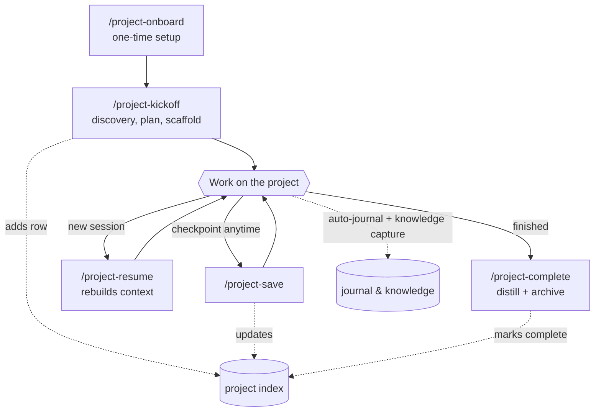

# Project — a project-management framework for Claude Code

`project` gives Claude a durable memory and workflow for multi-session work. It guides you
through starting a project, keeps a running journal so context survives across sessions,
captures reusable knowledge as you go, and lets you save and resume at any time.

## Overview

Most Claude sessions are stateless — close the window and the context is gone. `project`
fixes that by storing everything as plain-Markdown files under a folder you choose, and giving
Claude a set of skills, agents, and always-on rules that read and write those files for you.
Start a project once; pick it back up days later with full context rebuilt from its plan and
journal — and keep a bird's-eye view of every project you've ever started.

## What it is — and isn't

`project` is a **framework for managing ad hoc, multi-session projects** — the scaffolding,
durable memory, and lifecycle workflow that sit *on top of* whatever else Claude can already do.
It is **not** a replacement for task-specific or domain skills. It works alongside them: kickoff
reads the knowledge skills you already have, `system-scout` can bootstrap new ones for unfamiliar
systems, and the data agents handle bulk data work. Think of it as the project-management layer
that orchestrates your other skills for a piece of work — not a substitute for them.

## How it works

The framework is four layers working together:

- **State files** — your durable memory. A master *project index* lists every project; each
  project keeps its own plan, journal, and working folders. All plain Markdown you can read and
  edit yourself.
- **Skills** — the workflow. `/project-kickoff`, `/project-save`, `/project-resume`,
  `/project-complete`, and friends do the work of creating, updating, and reading those files.
- **Conventions** — always-loaded rules (installed at your projects root during onboarding) that
  tell Claude *when* to journal, capture knowledge, save research, and route data work — so
  nothing is lost without you having to ask.
- **Agents & hooks** — optional helpers for data-heavy work, plus secret-file protection so API
  keys never land in the conversation.

You mostly interact with the skills; the state files and conventions do the remembering.

Here's the lifecycle at a glance:



## What it tracks: the state files

Everything lives as Markdown under your projects folder (`{root}/`). There are two scopes:
a cross-project index, and each project's own files.

### The project index — your home base

`{root}/context/project-index.md` is a single table with one row per project, across all of
them:

| Project | Phase | Last Active | Status | Next Step |
|---------|-------|-------------|--------|-----------|
| acme-migration | Phase 3 | 2026-06-20 | Active | Verify cutover |
| q3-forecast | Done | 2026-05-02 | Complete | — |

Status is one of **Active · Blocked · Backlog · Complete · Archived**. The index is how
`/project-status` answers "where am I across everything?" and how `/project-kickoff` finds prior
projects that share a system or domain. `project-save` keeps it current — you don't hand-edit it.

### Each project's own files

A project lives in its own folder under the root — flat (`{root}/{project-name}/`) or nested in a
category folder you make (`{root}/clients/acme/`):

```
{project-name}/
├── CLAUDE.md            # Always-loaded: objective, constraints, compressed plan w/ checkboxes
├── project-plan.md      # The full approved plan, phase by phase
├── journal.md           # Running log — how a future session rebuilds context
├── inputs/              # Source data, uploads, exports
├── outputs/             # Deliverables, reports
├── data_raw/            # Raw external pulls
├── data_manipulated/    # Data you transformed or derived locally
├── research/            # Summarized findings with source links
├── scripts/             # Generated scripts
├── audit-logs/          # Trail of any external-system writes
└── .claude/             # Per-project tool permissions
```

`CLAUDE.md` is the always-loaded progress tracker (Claude reads it the moment you open the
folder); the **journal** is the long memory; the **plan** holds the detail.

## Components

**Lifecycle skills** (invoke by name, e.g. `/project-kickoff`):
- `project-onboard` — one-time setup: picks your projects folder, installs this framework's
  rules, and creates the starter project index.
- `project-kickoff` — start a new project: discovery, a written plan, and directory scaffolding.
- `project-scaffold` — creates the project directory and files (used by kickoff).
- `project-save` — checkpoint progress: writes a journal entry and updates the index.
- `project-resume` — rebuild context from a project's files and pick up where you left off.
- `project-status` — quick read-only status across one or all projects.
- `project-complete` — wrap up a finished project and distill what was learned.
- `project-learn` — capture reusable knowledge into shared files.
- `journal-write` — the journal entry format (used by the other skills).

**Agents** (optional helpers for data-heavy work):
- `data-fetch` — pulls and parses bulk/paginated data from external systems, read-only.
- `data-modify` — performs external writes safely, with approval and audit trails.
- `environment-scanner` — inventories your Claude setup during onboarding.
- `system-scout` — researches an unfamiliar system to bootstrap a knowledge skill.

**Secret protection** (two hooks): Claude is blocked from reading your API-key / secret files
directly — it must `source` them — so secret values never land in the conversation. The protected
location is the one you set during onboarding (it falls back to the common `~/.config/<system>/.env`
convention).

## Conventions it installs

Onboarding writes an always-loaded rules file at your projects root so Claude maintains the state
files without being told. The main ones:

- **Auto-journaling** — record a journal entry on the things that matter: data pulled or changed,
  non-trivial decisions, plan/scope changes, errors, completed milestones.
- **Knowledge capture** — when a reusable rule, gotcha, or preference surfaces, Claude raises it
  for your approval and saves it for future projects.
- **Research capture** — substantial research gets a summarized, source-linked writeup in
  `research/`, not just chat.
- **Data routing** — bulk/multi-step external reads go through `data-fetch`, external writes
  through `data-modify`; small, low-risk single-record actions run inline and are audit-logged.
- **Working-data split** — raw pulls in `data_raw/`, derived data in `data_manipulated/`,
  generated scripts in `scripts/`.
- **Guardrails** — confirm before writing project state from the wrong directory; one project per
  session; "save"/"checkpoint" always routes through `project-save`.

## It gets better the more you use it

The framework is designed to **accumulate context**, so each project starts further ahead than
the last:

- **Knowledge capture** turns one-off discoveries — a gotcha, an API limit, a business rule —
  into durable knowledge skills that auto-load next time they're relevant (`system-scout`
  bootstraps new ones for unfamiliar systems).
- **Every project's journal is permanent.** When you start something new, `project-kickoff`
  scans prior projects that share a system or domain and surfaces what they learned — so you
  don't re-discover the same things.
- **The project index** keeps the whole portfolio in view, and `project-complete` distills each
  finished project into reusable patterns.

Nothing is captured without your approval — but over time, the system knows more about your
tools, your decisions, and how you work.

## Setup

1. Install the plugin.
2. Run `/project-onboard`. It will ask where you keep your projects (or point it at an
   existing folder), install the framework's rules there, and create the starter project index.
3. That's it — start your first project with `/project-kickoff`.

New to the framework? The [getting-started walkthrough](docs/getting-started.md) walks through a
full project end to end.

`project` stores everything as Markdown under the folder you choose. It never stores secret
values and never modifies your global `~/.claude/CLAUDE.md`. The only things it writes outside
your projects folder are small one-line pointer files under `~/.claude/` — where your projects
live, and (if you use the data agents) where your secrets live, never the secrets themselves.

## Usage

```
/project-onboard      # once, to set up
/project-kickoff      # start a project (creates a new folder under your projects root)
/project-save         # checkpoint anytime
/project-resume       # come back later
/project-status       # where am I across projects?
/project-complete     # close one out
```

Journaling and knowledge capture happen automatically as you work — the installed rules prompt
Claude to record decisions, data pulls, and milestones so nothing is lost.

**Work from the project's folder.** The framework figures out which project you're in from the
folder your session is open in. Open the project's folder (wherever it lives under the root — it
can be nested in a category folder) and start your session there — that's how `/project-save`,
`/project-resume`, and `/project-status` know which project you mean, and how the project's own
`CLAUDE.md` loads. For a *new* project, **create its folder first, then open a new session in it
and run `/project-kickoff`** so everything happens in one session. Run a skill from the wrong place
and Claude flags the mismatch before writing anything.

## Customization

- **Where your data lives**: set during onboarding; stored in a one-line pointer at
  `~/.claude/project-root`, or override with the `CLAUDE_PROJECT_ROOT` environment variable.
- **Where your secrets live**: onboarding records the path (never the secret) so the data
  agents know where to source credentials from.
- **The data agents are optional** — if you don't connect external systems, you can ignore
  or remove them; the lifecycle skills work on their own.

## License

Source-available under the **MIT License with the [Commons Clause](https://commonsclause.com/)** —
see [LICENSE](LICENSE). You may use, modify, and share it freely (including inside a commercial
organization), but you may **not sell it** or offer it as a paid product or service whose value
derives substantially from this software without a commercial license. To inquire about a
commercial license, open an issue on this repository.
